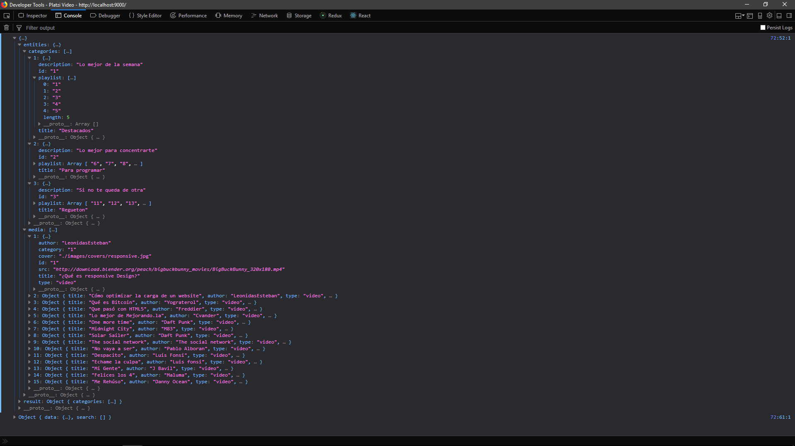

# Normalizando datos

Normilizr permite normalizar la información que se recibe desde la base de datos o desde una api.

La normalización tiene como objetivo evitar la redundancia de datos y haceer que acceder a esos datos sea más fácil.

instalar `npm install --save normalizr`

Asi se ve ya normalizado, muy diferente a como se encuentra en la api(api.json)

